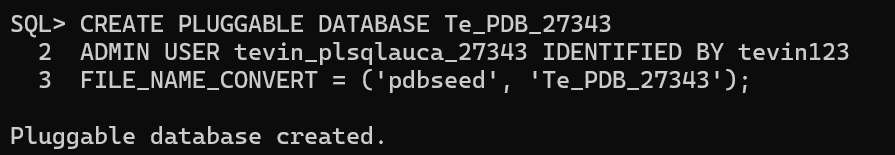
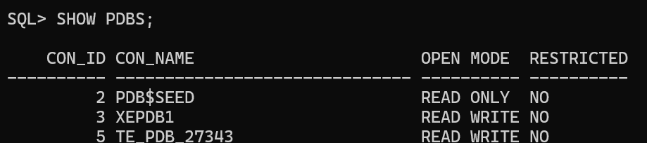
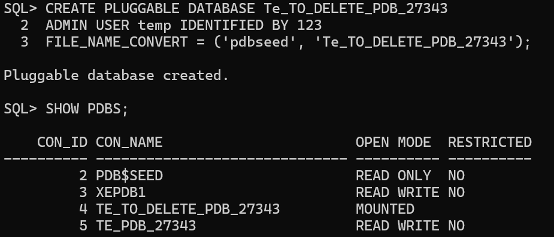
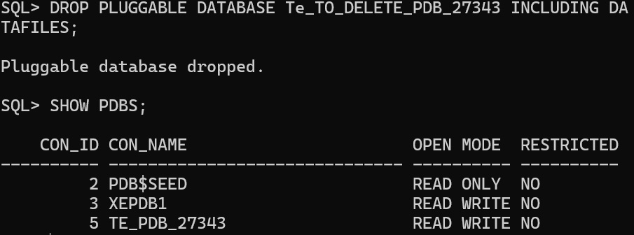
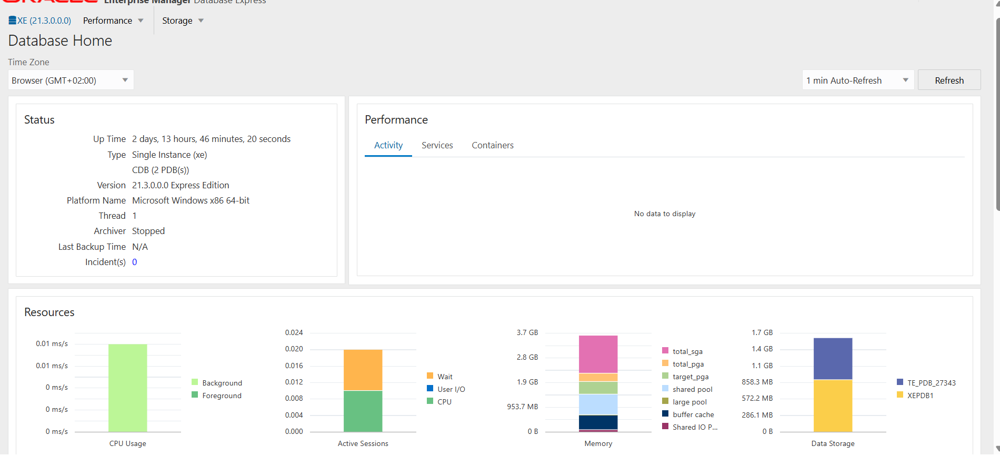

# Student Details
**Name:** Rutayisire Tevin  
**Student ID:** 27343
**Submission Date:** October 8, 2025

# Assignment II: Database Creation, Deletion & OEM

## Overview
This assignment covers the following tasks:

1. **Create a New Pluggable Database (PDB)**
	- Created a PDB named using the format: `FirstTwoLettersOfFirstName_pdb_StudentID`.
	- Example: `te_pdb_2024101`
	- Username format: `FirstName_plsqluca_StudentID` (e.g., `tevin_plsqluca_2024101`).
	- A simple password was chosen for the account.
	- This account will store all class work.

2. **Create and Delete a PDB**
	- Created another PDB with the format: `FirstTwoLettersOfName_to_delete_pdb_StudentID`.
	- Example: `te_to_delete_pdb_2024101`
	- After creation, the PDB was deleted.

3. **Oracle Enterprise Manager (OEM)**
	- Configured Oracle Enterprise Manager.
	- Provided a screenshot of the dashboard after completing Tasks 1 & 2.
	- The dashboard screenshot clearly shows the username.

## This is the output in images

+ **Task 1:**
	- PDB creation:
     
	  
	- Verification of created PDB:
     
	  

+ **Task 2:**

	- Temporary PDB creation:

		

	- Temporary PDB deletion:

		

+ **Task 3:**

	- OEM dashboard showing username:

		

## Notes & Issues
- All tasks were completed successfully.
- The main issue faced was installing Oracle. Installation required additional configuration and troubleshooting, which was resolved by following Oracle documentation and support forums.
- No other major issues were encountered. Minor issues, if any, were resolved by following Oracle documentation and class instructions.
